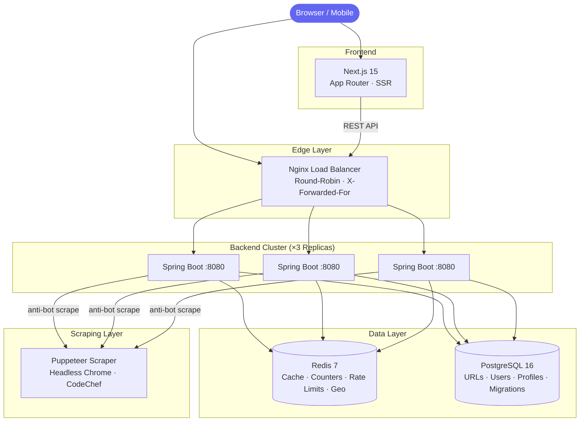
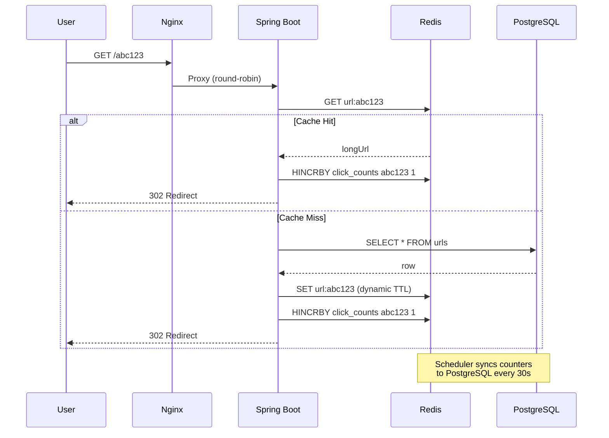
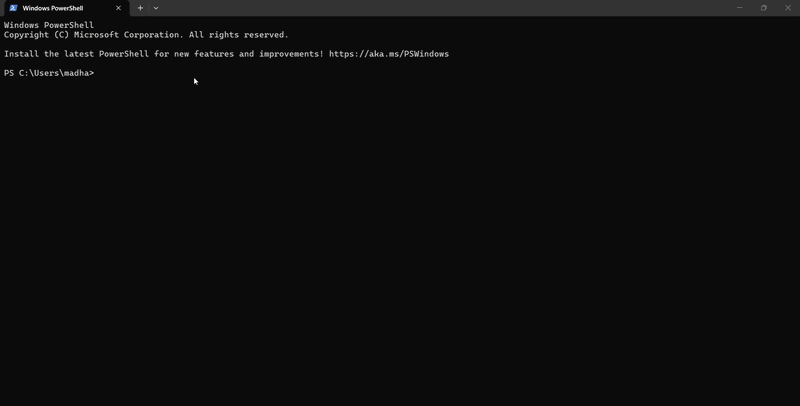

# ShunyaLink

> An all-in-one Smart URL Shortener and Digital Identity Platform featuring write-behind analytics, Geo-IP tracking, Link-in-Bio profiles, and a real-time Competitive Programming dashboard.
> Engineered with distributed caching, horizontal scaling, and real-world security &amp; AI trade-offs.

- 🔗 **Live:** https://shunyalink.madhavv.me
- 📖 **API Docs:** https://sl.madhavv.me/swagger-ui/index.html
- 🟢 **Health:** https://sl.madhavv.me/actuator/health

---

## Architecture



### Redirect Hot-Path



### Write-Behind Analytics

Clicks are **never written to the database on the redirect path.** Each redirect increments a Redis hash counter in microseconds. A background scheduler runs every 30 seconds, acquires a distributed UUID lock (ensuring only one instance syncs across the cluster), atomically renames the counter key, batch-flushes all counts to PostgreSQL, and releases the lock.

**Result:** Zero DB write pressure during peak traffic.

---

## Performance

### Production (k6 → Azure, 50 concurrent users)

| Metric | Result |
|--------|--------|
| Total Requests | **1,437** |
| Error Rate | **0%** |
| Checks Passed | **100%** (all 302 redirects) |
| Avg Response | **3.12s** |

> Avg latency includes cross-region internet round-trip (India → Azure). Zero requests dropped under sustained load.

### Local Cluster (k6 → 3-node Docker, 50 concurrent users)

| Metric | Result |
|--------|--------|
| Total Requests | **34,563** |
| Throughput | **288 req/s** |
| Error Rate | **0%** |
| Min Response | **3.74 ms** |
| Avg Response | **36 ms** |
| p95 Response | **48 ms** |

> 95%+ requests served entirely from Redis — zero database reads on the hot path.

### Failover Test

One backend node killed mid-traffic — Nginx reroutes to surviving replicas with zero downtime:



---

## Features

| Category | Feature |
|----------|---------|
| **Core** | Base62 short codes · Custom aliases · Link expiration · Password protection · UTM builder |
| **Analytics** | Write-behind click tracking · Time-series charts · Geo-IP distribution with self-healing · Referrer source tracking · Device & browser analytics |
| **Identity** | JWT auth · Google OAuth 2.0 · Email verification · Password reset · Cloudinary profile pictures |
| **Programmer Portfolio** | **Bento-Box UI** · Aggregated stats from **LeetCode, Codeforces, CodeChef, AtCoder** · GitHub Contribution Sync · Public `/portfolio/{username}` |
| **AI Insights** | **AI Profile Roast** (Gemini/Groq) · **Auto-Categorization** of shortlinks · **AI Phishing Detection** |
| **Bio-Link** | Drag-and-Drop Link Reordering · Public `/@username` profiles · Dynamic OG tags for social sharing · Theme customization · Show/hide links toggle |
| **Data** | CSV bulk import (drag-and-drop) · CSV export · Global dashboard search (title, URL, short ID, tags) · Custom tags |
| **Infra** | 3-node cluster · Nginx LB · Lua rate limiting · Cache warmup (top 1000) · **Branded QR Generation** (with logo overlay) · **Puppeteer Scraper** (headless Chrome for anti-bot bypass) · Actuator lockdown |
| **Security** | On-demand password reveal · AES-256 encryption · AI-driven URL safety verification |

---

## Why These Choices

**Base62 on sequential IDs** — Random UUIDs fragment B-tree indexes on every insert. Sequential IDs give ordered inserts; Base62 gives compact, URL-safe codes.

**Lua script for rate limiting** — Two separate Redis commands (`INCR` + `EXPIRE`) have a race window. If the app crashes between them, the key lives forever, permanently blocking that IP. A Lua script executes both atomically on the server.

**Write-Behind over Write-Through** — Writing to PostgreSQL on every click would bottleneck the hot redirect path. Buffering in Redis and batch-flushing every 30s decouples read latency from write durability.

**Flyway over `ddl-auto=update`** — Hibernate's auto-update silently modifies production schemas. Flyway gives versioned, auditable migrations (13 migrations across users, auth, profiles, analytics, ordering, tags, and cloud storage).

**Partial unique index** — Idempotency for permanent URLs is enforced at the database level. Same URL → same short ID. No application-level dedup logic needed.

**Geo-IP Self-Healing** — If the external lookup returns "Unknown" and later resolves, the system retroactively shifts one count from "Unknown" to the real country.

**On-demand password reveal** — Link passwords are never included in list/stats API responses. A dedicated authenticated endpoint (`/reveal-password`) decrypts and returns the password only when the owner explicitly requests it — same pattern as Google Password Manager.

**Synchronous AI Phishing Detection** — Scammers abuse URL shorteners to hide malware links. By passing the long URL through a Gemini LLM prompt synchronously during the `/shorten` request, we intercept and block typosquatting and scam links before they are even created. We implemented a **Resilient Fallback Pattern**: if Gemini rate-limits or fails, the request automatically falls back to Groq (Llama 3), and if both fail, the system fails-open to prevent breaking the core shortening functionality.

---

## Reliability & Observability

*   **Health Monitoring**: Integrated **Spring Boot Actuator** to provide real-time status of the JVM, Hibernate connection pool, and Redis connectivity.
*   **Live Frontend Heartbeat**: Implemented a dashboard-level monitoring component that polls the backend health status every 30 seconds, providing real-time "System Operational" feedback to the user.
*   **Production Readiness**: Configured custom health indicators to ensure the application only accepts traffic when all downstream services (Redis/PostgreSQL) are fully operational.
*   **Graceful Shutdown**: The platform is tuned to ensure all pending **Redis-to-PostgreSQL analytics syncs** are completed atomically before the container process exits during a deployment or scale-down event.

---

## Tech Stack

| Layer | Technology |
|-------|-----------|
| Backend | Java 21, Spring Boot 3.3 |
| Frontend | Next.js 15, React 19, TypeScript |
| Database | PostgreSQL 16 |
| Cache | Redis 7 |
| Migrations | Flyway 10 (13 versioned migrations) |
| Auth | JWT + Google OAuth 2.0 |
| AI | Gemini 2.0 Flash + Groq (Llama 3) — categorization, roasts, phishing detection |
| Cloud Storage | Cloudinary CDN (profile pictures, auto-compression to WebP) |
| Load Balancer | Nginx (Docker, 3 upstream replicas) |
| Docs | SpringDoc OpenAPI (Swagger) |
| Build | Maven · Docker Compose |

---

## API

| Method | Endpoint | Auth | Description |
|--------|----------|------|-------------|
| `POST` | `/api/v1/url/shorten` | ✅ | Shorten a URL (supports custom alias, password, tags, auto-title) |
| `GET` | `/{shortId}` | — | Redirect (or OG preview for social bots) |
| `GET` | `/api/v1/url/stats/{shortId}` | — | Click count + timestamps (supports `?range=24h\|7d\|all`) |
| `GET` | `/api/v1/url/my-links` | ✅ | Paginated user links (supports `?search=` full-text) |
| `POST` | `/api/v1/url/bulk-delete` | ✅ | Bulk delete links |
| `POST` | `/api/v1/url/bulk-import` | ✅ | CSV bulk import (drag-and-drop) |
| `GET` | `/api/v1/url/export/csv` | ✅ | CSV export of all user links |
| `PUT` | `/api/v1/url/reorder` | ✅ | Drag-and-drop link reordering |
| `PUT` | `/api/v1/url/{shortId}/bio-visibility` | ✅ | Toggle show/hide on bio profile |
| `PATCH` | `/api/v1/url/{shortId}/metadata` | ✅ | Update link title and password |
| `PATCH` | `/api/v1/url/{shortId}/tags` | ✅ | Update link tags |
| `GET` | `/api/v1/url/{shortId}/reveal-password` | ✅ | On-demand password reveal (owner only) |
| `POST` | `/api/v1/url/resolve/{shortId}` | — | Verify password and resolve long URL |
| `GET` | `/api/v1/url/qr/{shortId}` | — | QR code image (PNG) |
| `GET` | `/api/v1/url/stats/public` | — | Public system stats (links, users, clicks) |
| `POST` | `/api/v1/auth/register` | — | Register |
| `POST` | `/api/v1/auth/login` | — | Login (JWT) |
| `POST` | `/api/v1/auth/google` | — | Google OAuth |
| `GET` | `/api/v1/profile/me` | ✅ | Get authenticated user's profile |
| `POST` | `/api/v1/profile/settings` | ✅ | Update bio-link profile settings |
| `POST` | `/api/v1/profile/picture` | ✅ | Upload profile picture (Cloudinary) |
| `GET` | `/api/v1/profile/username-check` | ✅ | Check username availability |
| `GET` | `/api/v1/profile/{username}` | — | Public bio-link page |
| `GET` | `/api/v1/portfolio/{username}` | — | Public CP Portfolio stats |
| `GET` | `/api/v1/portfolio/{username}/roast` | — | AI profile roast (Gemini/Groq) |

Error codes: `400` invalid input · `404` not found · `409` alias taken · `410` expired · `429` rate limited

---

## Project Structure

```
backend/src/main/java/com/shunyalink/
├── analytics/
│   ├── AnalyticsScheduler.java       # Write-behind sync with distributed lock
│   ├── AnalyticsService.java         # Time-series + Geo-IP recording & self-healing
│   ├── GlobalStatsEntity.java        # Aggregate click counters
│   └── GlobalStatsRepository.java
├── auth/
│   ├── AuthController.java           # Register, Login, Google OAuth, Email verification
│   ├── AuthService.java              # Core auth logic + password reset
│   ├── CloudinaryService.java        # Profile picture upload + auto-compression
│   ├── EmailService.java             # Transactional emails (verification, reset)
│   ├── ProfileController.java        # Bio-link CRUD + profile picture upload
│   └── UserEntity.java               # JPA user model
├── cache/
│   └── CacheWarmup.java              # Top 1000 URLs preloaded on startup
├── config/
│   ├── AppConfig.java                # RestTemplate + async config
│   ├── RedisConfig.java              # RedisTemplate serialization
│   └── OpenApiConfig.java            # Swagger UI config
├── cp/
│   ├── CpController.java             # Multi-platform stats aggregator + roast endpoint
│   ├── LeetCodeService.java          # LeetCode GraphQL integration
│   ├── CodeforcesService.java        # Codeforces API integration
│   ├── GithubService.java            # GitHub API integration
│   ├── CodeChefService.java          # Delegates to Puppeteer scraper microservice
│   ├── AtCoderService.java           # JSoup-based AtCoder scraper
│   └── LlmIntegrationService.java    # Hybrid Groq/Gemini AI for roasts & categorization
├── exception/
│   └── GlobalExceptionHandler.java   # Centralized error handling (400/403/404/409/410/429)
├── rate/
│   └── RateLimiterService.java       # Atomic Lua rate limiting (fail-open)
├── scheduler/
│   └── ExpiredLinkCleanupScheduler.java  # Hourly expired link purge
├── security/
│   ├── SecurityConfig.java           # Spring Security filter chain
│   ├── JwtService.java               # JWT creation + validation
│   ├── JwtBlacklistService.java      # Token revocation via Redis
│   └── JwtAuthenticationFilter.java  # Per-request JWT filter
├── url/
│   ├── DbUrlService.java             # Core business logic + AI categorization
│   ├── Base62IdEncoder.java          # Sequential ID → Base62
│   ├── RedirectController.java       # /{shortId} redirect + social bot OG tags
│   ├── UrlController.java            # REST API endpoints (25+ routes)
│   ├── CsvImportService.java         # Bulk CSV import with validation
│   ├── CsvExportService.java         # CSV data export
│   ├── MetadataService.java          # Thread-safe URL title scraping
│   ├── QrController.java             # QR code generation
│   └── ReorderRequest.java           # DTO for drag-and-drop ordering
└── util/
    └── EncryptionUtils.java          # AES-256 encryption/decryption

frontend/
├── app/
│   ├── layout.tsx                    # Root layout + SEO/OG metadata
│   ├── page.tsx                      # Landing page
│   ├── login/ & register/            # Auth pages
│   ├── forgot-password/ & reset-password/ # Password recovery
│   ├── dashboard/                    # Link management + insights + settings
│   ├── [username]/                   # Public bio-link profiles (server-side OG tags)
│   ├── cp/[username]/                # CP portfolio page (server-side OG tags)
│   └── p/                            # Password challenge page
└── components/
    ├── header.tsx & footer.tsx        # Site chrome
    ├── shortener-form.tsx             # URL shortening form + UTM builder
    ├── user-profile-settings.tsx      # Bio-link editor + live preview + avatar upload
    ├── profile-card.tsx               # Public bio-link card (Normal + Programmer modes)
    ├── dashboard/                     # Dashboard panels (links, analytics, import modal, system status)
    ├── cp/                            # CP widgets (LeetCode, Codeforces, CodeChef, AtCoder, GitHub, Roast)
    └── home/                          # Homepage sections (hero, features, bio showcase, stats)

nginx/
└── nginx.conf                         # Load balancer for 3 backend replicas

scraper/
├── index.js                           # Express + Puppeteer headless Chrome scraper
├── package.json                       # Dependencies: express, puppeteer
└── Dockerfile.scraper                 # Node 20 + system Chromium

docker-compose.yml                     # Full stack: PG + Redis + 3×Backend + Scraper + Nginx + Frontend (11 containers)
```

---

## Production Deployment

| Component | Provider | Details |
|-----------|----------|---------|
| **Frontend** | Vercel | Next.js 15 SSR · Custom domain `shunyalink.madhavv.me` |
| **Backend** | Azure App Service | Spring Boot 3 · Java 21 · Custom domain `sl.madhavv.me` |
| **Database** | Supabase | PostgreSQL 17 · Connection pooling via Supavisor |
| **Cache** | Upstash | Serverless Redis · TLS · Write-behind analytics pipeline |
| **Scraper** | DigitalOcean App Platform | Puppeteer + Headless Chromium · Dockerized |

---

## Running Locally

**Prerequisites:** Docker & Docker Compose

```bash
# 1. Clone
git clone https://github.com/madhavthesiya/shunyalink.git
cd shunyalink

# 2. Set environment variables
cp .env.example .env
# Edit .env — fill in ALL values (see table below)

# 3. Start everything (PostgreSQL + Redis + 3×Backend + Scraper + Nginx + Frontend)
docker-compose up --build
```

### Required Environment Variables

| Variable | Description |
|----------|-------------|
| `DB_USERNAME` | PostgreSQL username |
| `DB_PASSWORD` | PostgreSQL password |
| `APP_BASE_URL` | Public backend URL (`http://localhost` for local) |
| `ALLOWED_ORIGIN` | Frontend origin for CORS (`http://localhost:3000` for local) |
| `JWT_SECRET` | 256-bit secret for JWT signing (`openssl rand -base64 32`) |
| `ENCRYPTION_SECRET` | 32-char key for AES-256 link password encryption |
| `MAIL_USERNAME` | Gmail address for transactional emails |
| `MAIL_PASSWORD` | Gmail App Password ([generate here](https://myaccount.google.com/apppasswords)) |
| `GEMINI_API_KEY` | Google Gemini API key (AI categorization + phishing detection) |
| `GROQ_API_KEY` | Groq API key (AI profile roasts) |
| `CLOUDINARY_URL` | Cloudinary environment URL (profile picture uploads) |

| Service | URL |
|---------|-----|
| Frontend | `http://localhost:3000` |
| Backend (via Nginx) | `http://localhost` |
| Swagger Docs | `http://localhost/swagger-ui/index.html` |
| System Health | `http://localhost/actuator/health` |
| PostgreSQL | `localhost:5432` |
| Redis | `localhost:6379` |
| Scraper | `http://localhost:3001` |

Flyway runs all 13 migrations automatically on first startup.

---

**Made by [Madhav Thesiya](https://www.linkedin.com/in/madhavthesiya/)** — If this was useful, drop a ⭐
