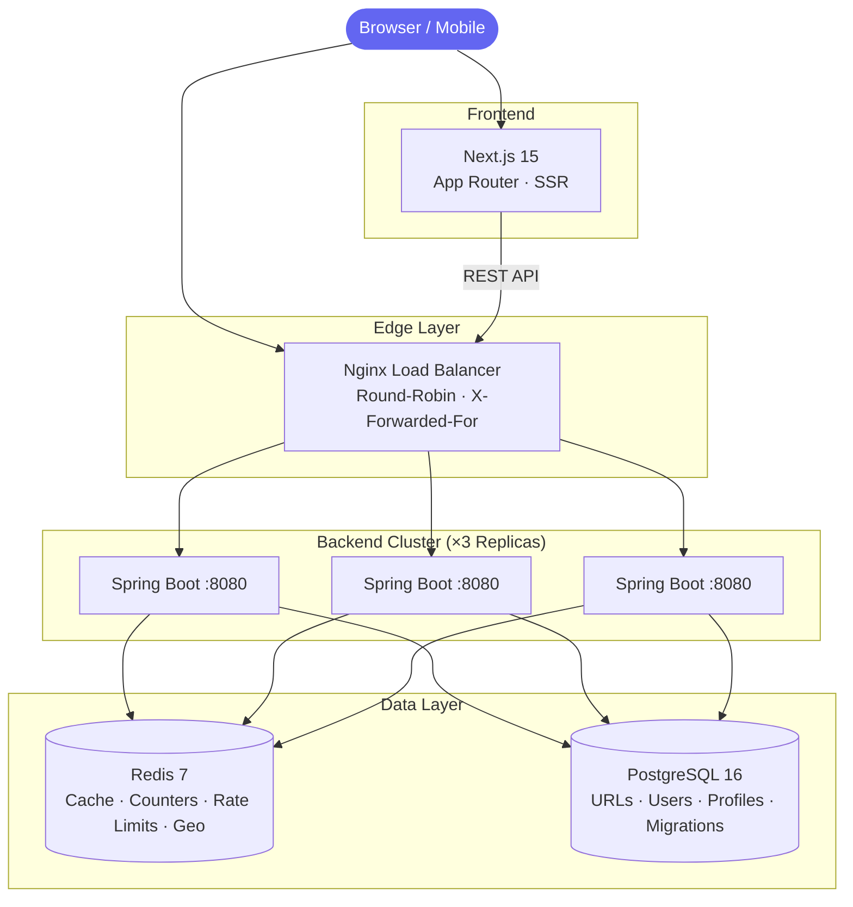
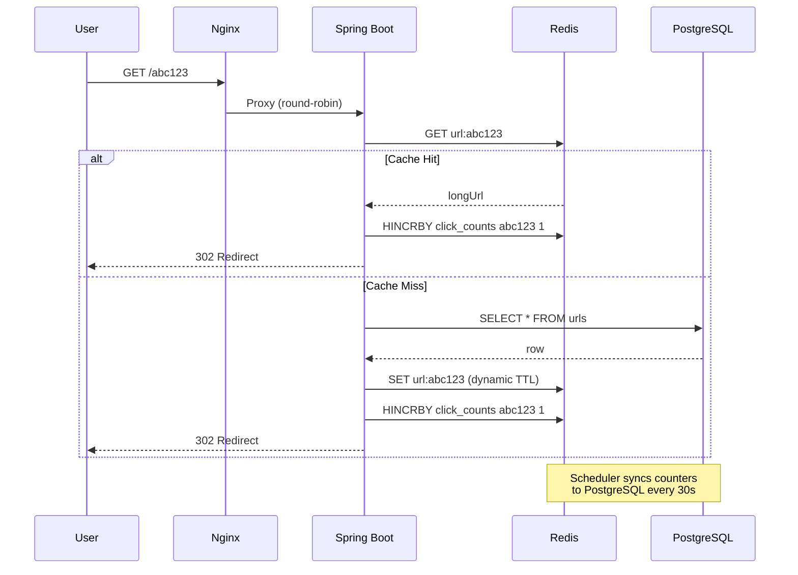

# ShunyaLink

> A distributed URL management platform with write-behind analytics, Geo-IP tracking, and Link-in-Bio profiles.
> Engineered with distributed caching, horizontal scaling, and real-world engineering trade-offs.

🔗 **Live:** [shunyalink.madhavv.me](https://shunyalink.madhavv.me) &nbsp;·&nbsp; 📡 **Short Domain:** [sl.madhavv.me](https://sl.madhavv.me)

---

## Architecture



### Redirect Hot-Path



### Write-Behind Analytics

Clicks are **never written to the database on the redirect path.** Each redirect increments a Redis hash counter in microseconds. A background scheduler runs every 30 seconds, acquires a distributed UUID lock (ensuring only one instance syncs across the cluster), atomically renames the counter key, batch-flushes all counts to PostgreSQL, and releases the lock.

**Result:** Zero DB write pressure during peak traffic.

---

## Performance

### Production (k6 → Azure, 50 concurrent users)

| Metric | Result |
|--------|--------|
| Total Requests | **1,437** |
| Error Rate | **0%** |
| Checks Passed | **100%** (all 302 redirects) |
| Avg Response | **3.12s** |

> Avg latency includes cross-region internet round-trip (India → Azure). Zero requests dropped under sustained load.

### Local Cluster (k6 → 3-node Docker, 50 concurrent users)

| Metric | Result |
|--------|--------|
| Total Requests | **34,563** |
| Throughput | **288 req/s** |
| Error Rate | **0%** |
| Min Response | **3.74 ms** |
| Avg Response | **36 ms** |
| p95 Response | **48 ms** |

> 95%+ requests served entirely from Redis — zero database reads on the hot path.

### Failover Test

One backend node killed mid-traffic — Nginx reroutes to surviving replicas with zero downtime:


---

## Features

| Category | Feature |
|----------|---------|
| **Core** | Base62 short codes · Custom aliases · Link expiration · Password protection |
| **Analytics** | Write-behind click tracking · Time-series charts · Geo-IP distribution with self-healing |
| **Identity** | JWT auth · Google OAuth 2.0 · Email verification · Password reset |
| **Bio-Link** | Public `/@username` profiles · Theme customization · Show/hide links toggle |
| **Infra** | 3-node cluster · Nginx LB · Lua rate limiting · Cache warmup (top 1000) · QR generation |
| **SEO** | Social bot detection (OG tags) · Sitemap · robots.txt · Canonical URLs |

---

## Why These Choices

**Base62 on sequential IDs** — Random UUIDs fragment B-tree indexes on every insert. Sequential IDs give ordered inserts; Base62 gives compact, URL-safe codes.

**Lua script for rate limiting** — Two separate Redis commands (`INCR` + `EXPIRE`) have a race window. If the app crashes between them, the key lives forever, permanently blocking that IP. A Lua script executes both atomically on the server.

**Write-Behind over Write-Through** — Writing to PostgreSQL on every click would bottleneck the hot redirect path. Buffering in Redis and batch-flushing every 30s decouples read latency from write durability.

**Flyway over `ddl-auto=update`** — Hibernate's auto-update silently modifies production schemas. Flyway gives versioned, auditable migrations (9 migrations across users, auth, profiles, analytics).

**Partial unique index** — Idempotency for permanent URLs is enforced at the database level. Same URL → same short ID. No application-level dedup logic needed.

**Geo-IP Self-Healing** — If the external lookup returns "Unknown" and later resolves, the system retroactively shifts one count from "Unknown" to the real country.

---

## Tech Stack

| Layer | Technology |
|-------|-----------|
| Backend | Java 21, Spring Boot 3.3 |
| Frontend | Next.js 15, React 19, TypeScript |
| Database | PostgreSQL 16 |
| Cache | Redis 7 |
| Migrations | Flyway 10 (9 versioned migrations) |
| Auth | JWT + Google OAuth 2.0 |
| Load Balancer | Nginx (Docker, 3 upstream replicas) |
| Docs | SpringDoc OpenAPI (Swagger) |
| Build | Maven · Docker Compose |

---

## API

| Method | Endpoint | Auth | Description |
|--------|----------|------|-------------|
| `POST` | `/api/v1/url/shorten` | ✅ | Shorten a URL |
| `GET` | `/{shortId}` | — | Redirect (or OG preview for bots) |
| `GET` | `/api/v1/url/stats/{shortId}` | — | Click count + timestamps |
| `GET` | `/api/v1/url/insights/{shortId}` | ✅ | Time-series + Geo-IP analytics |
| `GET` | `/api/v1/url/my-links` | ✅ | Paginated user links |
| `POST` | `/api/v1/url/bulk-delete` | ✅ | Bulk delete links |
| `GET` | `/api/v1/url/export/csv` | ✅ | CSV export |
| `GET` | `/api/v1/url/qr/{shortId}` | — | QR code image |
| `POST` | `/api/v1/auth/register` | — | Register |
| `POST` | `/api/v1/auth/login` | — | Login (JWT) |
| `POST` | `/api/v1/auth/google` | — | Google OAuth |
| `GET` | `/api/v1/profile/me` | ✅ | Get user profile |
| `POST` | `/api/v1/profile/settings` | ✅ | Update bio-link profile |
| `GET` | `/api/v1/profile/{username}` | — | Public bio-link page |

Error codes: `400` invalid input · `404` not found · `409` alias taken · `410` expired · `429` rate limited

---

## Project Structure

```
backend/src/main/java/com/shunyalink/
├── analytics/
│   ├── AnalyticsScheduler.java       # Write-behind sync with distributed lock
│   ├── AnalyticsService.java         # Time-series + Geo-IP recording & self-healing
│   ├── GlobalStatsEntity.java        # Aggregate click counters
│   └── GlobalStatsRepository.java
├── auth/
│   ├── AuthController.java           # Register, Login, Google OAuth, Email verification
│   ├── AuthService.java              # Core auth logic + password reset
│   ├── EmailService.java             # Transactional emails (verification, reset)
│   ├── ProfileController.java        # Bio-link CRUD
│   └── UserEntity.java               # JPA user model
├── cache/
│   └── CacheWarmup.java              # Top 1000 URLs preloaded on startup
├── config/
│   ├── AppConfig.java                # RestTemplate + async config
│   ├── RedisConfig.java              # RedisTemplate serialization
│   └── OpenApiConfig.java            # Swagger UI config
├── exception/
│   └── GlobalExceptionHandler.java   # Centralized error handling
├── rate/
│   └── RateLimiterService.java       # Atomic Lua rate limiting (fail-open)
├── scheduler/
│   └── ExpiredLinkCleanupScheduler.java  # Hourly expired link purge
├── security/
│   ├── SecurityConfig.java           # Spring Security filter chain
│   ├── JwtService.java               # JWT creation + validation
│   ├── JwtBlacklistService.java      # Token revocation via Redis
│   └── JwtAuthenticationFilter.java  # Per-request JWT filter
└── url/
    ├── DbUrlService.java             # Core business logic
    ├── Base62IdEncoder.java          # Sequential ID → Base62
    ├── RedirectController.java       # /{shortId} redirect + social bot OG tags
    ├── UrlController.java            # REST API endpoints
    ├── MetadataService.java          # Thread-safe URL title scraping
    ├── QrController.java             # QR code generation
    └── CsvExportService.java         # CSV data export

frontend/
├── app/
│   ├── layout.tsx                    # Root layout + SEO metadata
│   ├── page.tsx                      # Landing page
│   ├── login/ & register/           # Auth pages
│   ├── dashboard/                    # Link management + insights
│   ├── [username]/                   # Public bio-link profiles
│   └── p/                            # Password challenge page
└── components/
    ├── header.tsx & footer.tsx        # Site chrome
    ├── shortener-form.tsx            # URL shortening form
    ├── user-profile-settings.tsx     # Bio-link editor + live preview
    ├── profile-card.tsx              # Public bio-link card
    └── stats-modal.tsx               # Click analytics modal

nginx/
└── nginx.conf                        # Load balancer for 3 backend replicas

docker-compose.yml                    # Full stack: PG + Redis + 3×Backend + Nginx + Frontend
```

---

## Running Locally

**Prerequisites:** Docker & Docker Compose

```bash
# 1. Clone
git clone https://github.com/madhavthesiya/shunyalink.git
cd shunyalink

# 2. Set environment variables
cp .env.example .env
# Edit .env with your DB_USERNAME, DB_PASSWORD, JWT_SECRET

# 3. Start everything
docker-compose up --build
```

| Service | URL |
|---------|-----|
| Frontend | `http://localhost:3000` |
| Backend (via Nginx) | `http://localhost` |
| Swagger Docs | `http://localhost/swagger-ui.html` |
| PostgreSQL | `localhost:5432` |
| Redis | `localhost:6379` |

Flyway runs all 9 migrations automatically on first startup.

---

**Made by [Madhav Thesiya](https://www.linkedin.com/in/madhavthesiya/)** — If this was useful, drop a ⭐
