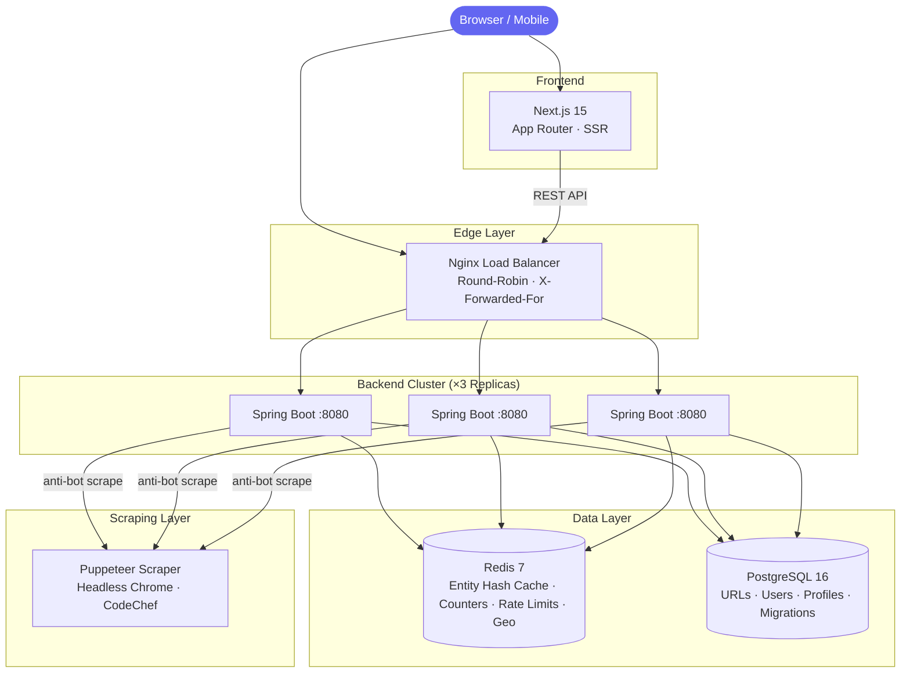
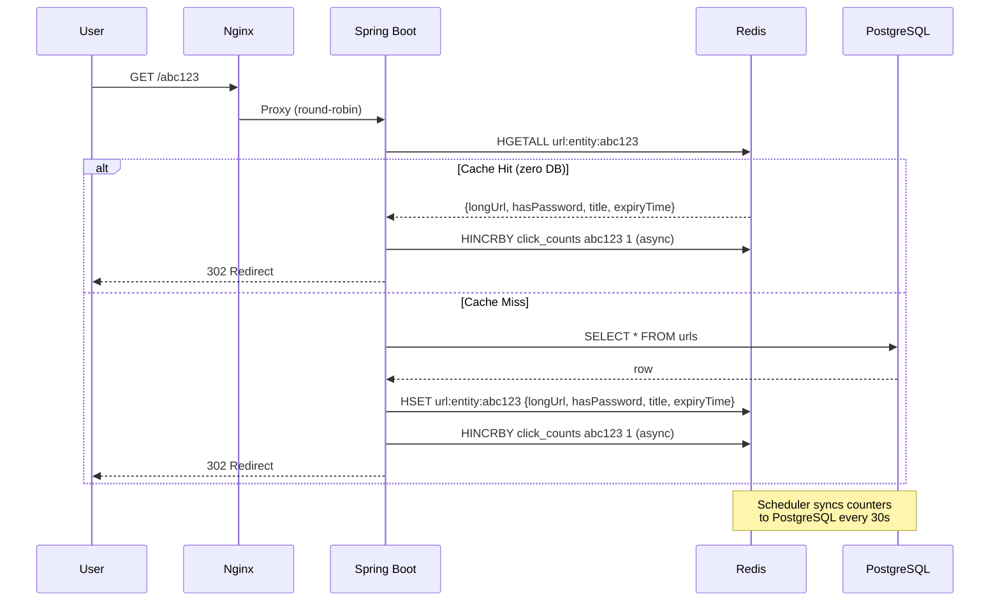

# Architecture

## Redirect Hot-Path

> **Why Redis Hash instead of a simple string?** The redirect path needs more than just the long URL — it must check password protection, expiry time, and the page title (for social bot OG tags). Caching all redirect-critical fields as a Hash eliminates the database query entirely on cache hits. See [Performance Optimization](performance.md#performance-optimization) for the full story.

## Write-Behind Analytics

Clicks are **never written to the database on the redirect path.** Each redirect increments a Redis hash counter in microseconds via a bounded `ThreadPoolTaskExecutor` (10 core, 50 max threads). A background scheduler runs every 30 seconds, acquires a distributed UUID lock (ensuring only one instance syncs across the cluster), atomically renames the counter key, batch-flushes all counts to PostgreSQL, and releases the lock.

**Result:** Zero DB write pressure during peak traffic.
